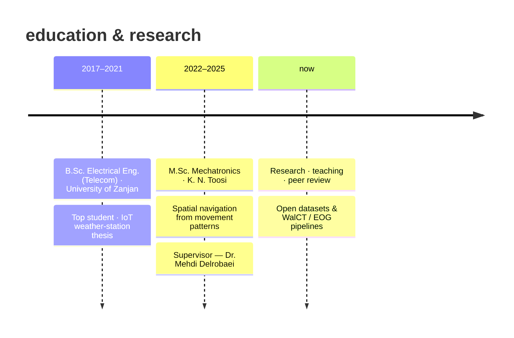

<!-- Profile theme: path · signal · motion -->

<p align="center">
  
  &nbsp;&nbsp;
  
  &nbsp;&nbsp;
  
</p>

<h1 align="center">
  
</h1>

<p align="center">
  
</p>

<p align="center">
  <b>M.Sc. Mechatronics</b> · Biomechatronics Lab · K. N. Toosi University of Technology<br/>
  <i>she/her</i> · non-invasive cognitive assessment through movement, gaze & sensor fusion
</p>

<p align="center">
  <a href="https://mobina-zibandehpoor.github.io/"></a>
  <a href="mailto:mobinazibandeh@gmail.com"></a>
  <a href="https://www.linkedin.com/in/mobina-zibandehpoor/"></a>
  <a href="https://scholar.google.com/citations?user=_-slqcUAAAAJ&hl=en"></a>
  <a href="https://orcid.org/0009-0003-2355-5383"></a>
</p>

<br/>

## the idea

I study **how humans navigate space** — and how we can measure that ability without invasive tools.

My work sits between **mechatronics**, **computer vision**, and **cognitive science**. In the lab I build pipelines that turn everyday signals — walking trajectories, head motion, eye movements — into indices that say something real about spatial memory and sense of direction.

Thesis focus: a non-invasive framework using **vision-based pose estimation** + **IMU motion capture**, with ML for feature extraction and interpretability. Parallel track: **EOG eye tracking** during the Leiden Navigation Test.

<p align="center">
  
</p>

<br/>

## how I think about a study

```text
          ┌─────────────┐     ┌─────────────┐     ┌─────────────┐
   walk → │   cameras   │ ──▸ │   RTMPose   │ ──▸ │ trajectory  │
          │   + IMUs    │     │  / OpenPose │     │  + joints   │
          └─────────────┘     └─────────────┘     └──────┬──────┘
                                                         │
          ┌─────────────┐     ┌─────────────┐            ▼
   gaze → │     EOG     │ ──▸ │ blinks ·    │     ┌─────────────┐
          │  H / V ch.  │     │ saccades ·  │ ──▸ │  multimodal │
          └─────────────┘     │ fixations   │     │  classifier │
                              └─────────────┘     └─────────────┘
```

<br/>

## what I've been building

<table>
<tr>
<td width="50%" valign="top">

### open data
**[EOG · Leiden Navigation Test](https://github.com/mobina-zibandehpoor/EOG-LNT-Spatial-Navigation-Dataset)**  
27 healthy participants · vertical & horizontal EOG during LNT  
→ published in *Nature Scientific Data*

### motion pipelines
**[MoWalCT · RTMPose trajectories](https://github.com/mobina-zibandehpoor/MoWalCT-RTMPose-trajectory-extraction)**  
Walking Corsi paths, extracted & cleaned

**[MoWalCT · head / trunk angles](https://github.com/mobina-zibandehpoor/MoWalCT-head-trunk-cleaned-joint-angles)**  
joint-angle cleaning for WalCT analysis

</td>
<td width="50%" valign="top">

### gaze & vision
**[L2CS-Net gaze detection](https://github.com/mobina-zibandehpoor/L2CS-Net-Gaze-Detection)**  
video gaze estimation · L2CS-Net + Gaze360

### geometry
**[Brain 3D CAD models](https://github.com/mobina-zibandehpoor/Brain-3D-Cad-Model)**  
human brain models for biomechatronics work

### writing home
**[Academic portfolio](https://mobina-zibandehpoor.github.io/)**  
papers, experience, and notes

</td>
</tr>
</table>

<br/>

## papers that matter most to me right now

| year | venue | note |
|:----:|:------|:-----|
| 2025 | *Scientific Data* (Nature) | EOG dataset for objective spatial navigation assessment |
| 2026 | IEEE ICWR | multimodal sense-of-direction from trajectory + head motion |
| 2025 | CSICC | eye-movement biometrics in navigation · **Best Paper** |
| 2024 | ICRoM | WalCT trajectory assessment via pose estimation |
| 2024 | arXiv | Persian Wayfinding Questionnaire |

<p align="center">
  <a href="https://scholar.google.com/citations?user=_-slqcUAAAAJ&hl=en">full scholar list →</a>
  &nbsp;·&nbsp;
  <a href="https://orcid.org/0009-0003-2355-5383">orcid →</a>
  &nbsp;·&nbsp;
  <a href="https://www.researchgate.net/profile/Mobina-Zibandehpoor">researchgate →</a>
</p>

<br/>

## path so far



<br/>

## toolkit

<p align="center">
  
</p>

<p align="center">
  
  
  
  
  
</p>

<br/>

## milestones

<p align="center">
  
  
</p>

- 3rd place — 3-Minute Thesis & 3-Minute Article (K. N. Toosi)
- Best seminar — Electrical Engineering Faculty (2024)
- 3rd place — Best Bachelor's Thesis in IoT (national, 2022)
- TA — Biomechatronic Systems & Neuromuscular Control Systems
- Peer reviewer — IEEE Access · Int. Journal of Web Research · MEAAC

<br/>

## activity

<p align="center">
  
</p>

<p align="center">
  
  
</p>

<br/>

## say hello

I'm open to collaborations on **spatial cognition**, **HCI**, **biosignals**, and **AI for behavioral assessment**.

<p align="center">
  <a href="mailto:mobinazibandeh@gmail.com">
    
  </a>
</p>

<p align="center">
  
</p>

<p align="center">
  
</p>
